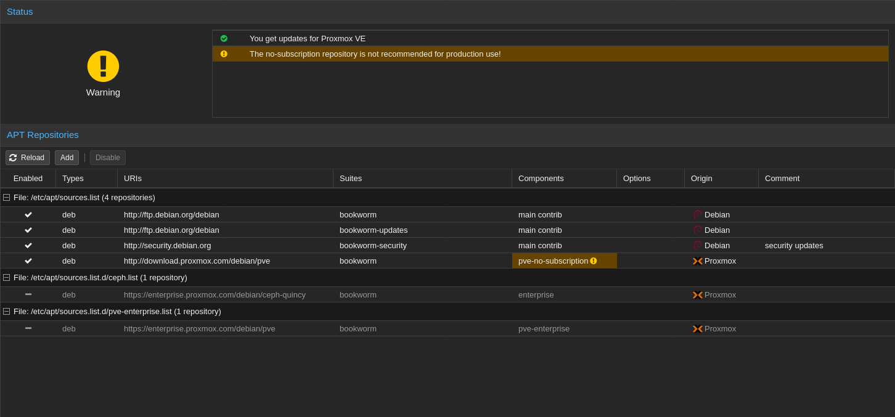

## Post Installation

1. change your enterprise repos to community repos



2. run `apt-get update && apt-get dist-upgrade` to get your apt files up and synced.


## Packages

1. Install apt packages 

```
numactl
vim
```


## Testing 

4. To test numa archetecture use 

```bash
numactl --hardware | grep "spaceavailable" 
```

## Host Config (GPU PASSTHROUGH)

The gpu passthrough is recommended to be done before installing in any vm, which required gpu compute.

### Grub Configs

```bash
GRUB_CMDLINE_LINUX_DEFAULT="quiet amd_iommu=on iommu=pt"
```

then 

```bash
update-grub
```

### Blacklisting Modules 

edit /etc/modules

```bash
vfio
vfio_iommu_type1
vfio_pci
vfio_virqfd
```

then run this to verify

```bash
dmesg | grep -e DMAR -e IMOMMU -e AMD-VI
```


### IOMMU intrupt remapping

run 

```bash
echo "options vfio_iommu_type1 allow_unsafe_interrupts=1" > /etc/modprobe.d/iommu_unsafe_interrupts.conf
echo "options kvm ignore_msrs=1" > /etc/modprobe.d/kvm.conf
```

### Blacklisting Nvidia

```bash
echo "blacklist nouveau" >> /etc/modprobe.d/blacklist.conf
echo "blacklist nvidia" >> /etc/modprobe.d/blacklist.conf
```

### Adding gpu to vfio

```bash
lspci -v
```


```bash
lspci -n -s 26:00
```

```bash
echo "options vfio-pci ids=10de:1e89,10de:10f8,10de:1ad8,10de:1ad9 disable_vga=1"> /etc/modprobe.d/vfio.conf
```

```bash
update-initramfs -u
```

